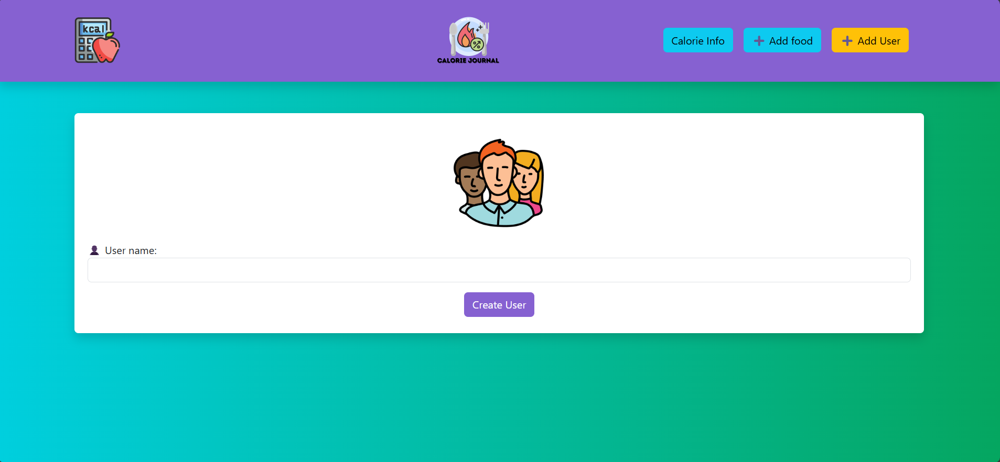
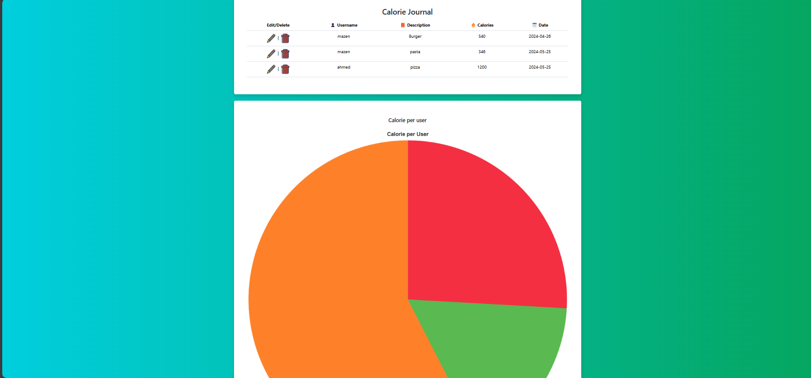

# Calorie Tracker
## Installation
```sh
# Clone the repo
git clone https://github.com/mazen251/Calories-Counter-MERN-stack-website.git

# Navigate to the project directory
cd Calories-Counter-MERN-stack-website
cd server
npm i
cd ..
cd client
npm i
cd ..

# Start the development server
cd server
npm start
cd client
npm start
```

## UI/UX
### Create User


### Add Meal


### Main Page & Pie Chart

